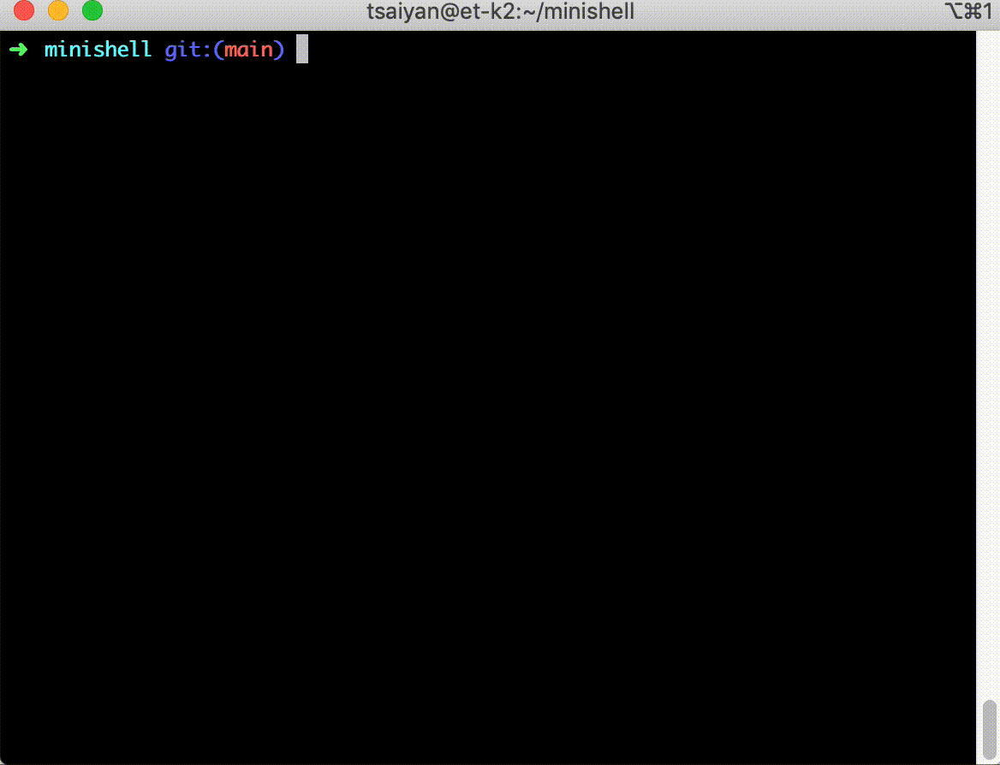

# Minishell

#### Objective:
Write a shell, that will be imitate original Bash.

#### Allowed functions:
malloc, free, write, open, read, close, fork, wait,
waitpid, wait3, wait4, signal, kill, exit, getcwd,
chdir, stat, lstat, fstat, execve, dup, dup2, pipe,
opendir, readdir, closedir, strerror, errno.

#### How to run:
    Make
    ./minishell

#### Skills:
Team work, processes, pipes, redirects, signals.

#### Projects written with the NORM 42.
Basic points:
  - 25 strings max in func.
  - 5 funcs in file, max 4 arguments, max 5 variables.
  - One declaration = one string.
  - Declaration and initialisation can't be in same string.
  - Forbitten to use: for, switch, do...while, go to, case, Conditional operator.
  - No comments in body of functions.

